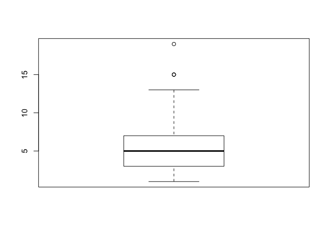
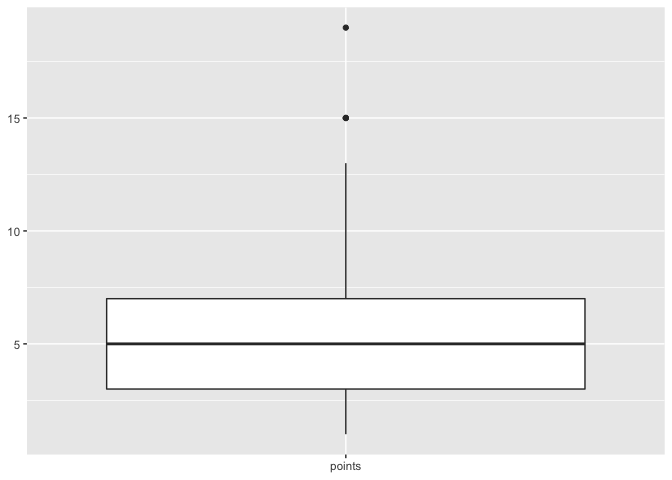

Outlier analysis
================
Will Canniford

-   [Definition](#definition)
-   [Visualising outliers](#visualising-outliers)
    -   [Univariate analysis](#univariate-analysis)
    -   [Multivariate outliers (Categorical + numeric)](#multivariate-outliers-categorical-numeric)
    -   [Multivariate outliers (Numeric + numeric)](#multivariate-outliers-numeric-numeric)
-   [Which rows contain outliers?](#which-rows-contain-outliers)
-   [Strategies for outliers](#strategies-for-outliers)

This file is the notes that I have made based on the data cleaning challenges hosted by Rachel from Kaggle.

``` r
library(ggplot2)
library(outliers)
```

Outliers can be present in data sets for a number of reasons. It can be due to genuine variation in the data, and can also be due to bad data collection and errors in the way that data has been recorded.

### Definition

An outlier is essentially a data point that is far away from other data points. Mathematically an outlier is generally defined as a point that is more than 3 standard deviations from the mean; sometimes this is reduced to 2.5 standard deviations. This isn't the only way that outliers are defined, but it is the one that is most commonly seen.

**Z-score**: this represents the number of standard deviations that a point is away from the mean. It can be negative, and when this is the case, this means that the data point in question is below the mean.

One of the easiest way to see outliers in data is to plot it.

Visualising outliers
--------------------

### Univariate analysis

With the analysis of a single variable, it is fairly easy to plot the outliers because you can simply use the boxplot graph. This is because outliers are clearly shown in a boxplot plot.
This is easy enough to achieve using `ggplot` as such:

``` r
gglot(data, aes(x = 'column_name', y = column_name)) + 
  geom_boxplot()
```

Outliers are then shown as actual points outside of the range of the 'whiskers'. I will generate some data below to illustrate the point further:

``` r
set.seed(10)
points <- sample(x = 1:10, replace = TRUE, size = 100)
points <- c(points, sample(13:19, replace = TRUE, size = 5))
boxplot(points)
```



``` r
ggplot(as.data.frame(points), aes(x = 'points', y = points)) +
  geom_boxplot() + 
  labs(x = NULL, y = NULL)
```

 As you can see from both of these plots, the outliers are represented by actual points on the graph that fall outside of the regular 'box' parts of the graph.

### Multivariate outliers (Categorical + numeric)

You can gain further insight into a numerical variable is to break it down by a categorical variable.

``` r
ggplot(data, aes(grouping_variable, numeric_variable)) +
    geom_boxplot()
```

### Multivariate outliers (Numeric + numeric)

Comparing two numeric vavriables against one another might be important when trying to establish large outliers that might impact the efficiency of regression analysis. A scatter plot is an effective way to do this.

Which rows contain outliers?
----------------------------

You can work this out using the `outliers::scores()` function that returns the z score.

``` r
points <- as.data.frame(points)
points$z_score <- outliers::scores(points$points)
points$is_outlier <- points$z_score < -3 | points$z_score > 3
print(head(points))
```

    ##   points   z_score is_outlier
    ## 1      6  0.159676      FALSE
    ## 2      4 -0.428604      FALSE
    ## 3      5 -0.134464      FALSE
    ## 4      7  0.453816      FALSE
    ## 5      1 -1.311024      FALSE
    ## 6      3 -0.722744      FALSE

Now that we have a method for identifying those points that are considered outliers, it is the next step about dealing with them that is equally important.

Strategies for outliers
-----------------------

You could just remove them from your data frame... This is a fairly rushed option. You would tend to do this when you have a lot of data that isn't considered an outlier, you don't have a lot of time to work through the outliers or you have lots of outliers due to data input error.

You could consider the outliers and inliers as separate entities by splitting them based on the boolean value that we previously created.

If you think that the outliers are artificial and represent untrue values then you can alsways consider removing those values and imputing replacement ones; essentially you are treating those values as `NA` in this instance.

``` r
data[outlier_scores > 3| outlier_scores < -3, "column_name"] <- NA`
```
